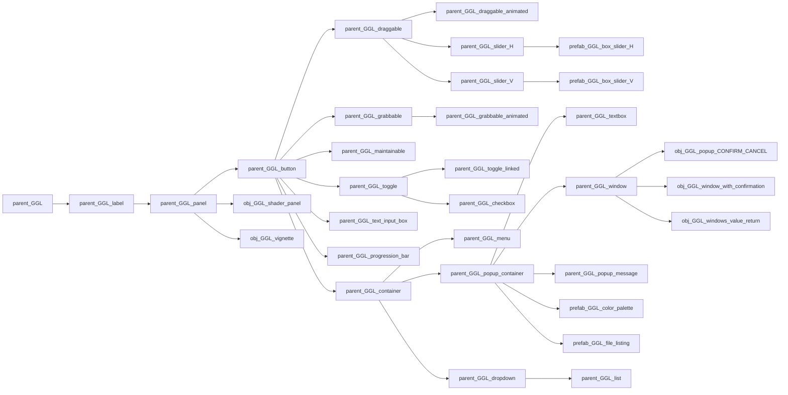

```mermaid
graph LR
A[parent_GGL] --> B[parent_GGL_label] --> C[parent_GGL_panel] --> D[parent_GGL_button]
C[parent_GGL_panel] --> AF[obj_GGL_shader_panel]
C[parent_GGL_panel] --> AG[obj_GGL_vignette]
D[parent_GGL_button] --> E[parent_GGL_draggable]
D[parent_GGL_button] --> F[parent_GGL_grabbable]
E[parent_GGL_draggable] --> G[parent_GGL_draggable_animated]
F[parent_GGL_grabbable] --> H[parent_GGL_grabbable_animated]
E[parent_GGL_draggable] --> N[parent_GGL_slider_H] -->
AB[prefab_GGL_box_slider_H]
E[parent_GGL_draggable] -->
AA[parent_GGL_slider_V] -->
AC[prefab_GGL_box_slider_V]
D[parent_GGL_button] --> I[parent_GGL_maintainable]
D[parent_GGL_button] --> J[parent_GGL_toggle]
J[parent_GGL_toggle] --> K[parent_GGL_toggle_linked]
D[parent_GGL_button] --> L[parent_GGL_text_input_box]
D[parent_GGL_button] --> M[parent_GGL_progression_bar]
D[parent_GGL_button] --> O[parent_GGL_container]
J[parent_GGL_toggle] --> P[parent_GGL_checkbox]
O[parent_GGL_container] --> Q[parent_GGL_menu]
O[parent_GGL_container] --> R[parent_GGL_popup_container]
O[parent_GGL_container] --> S[parent_GGL_dropdown]
S[parent_GGL_dropdown] --> T[parent_GGL_list]
R[parent_GGL_popup_container] --> U[parent_GGL_textbox]
R[parent_GGL_popup_container] --> V[parent_GGL_window]
R[parent_GGL_popup_container] --> W[parent_GGL_popup_message]
R[parent_GGL_popup_container] --> AD[prefab_GGL_color_palette]
R[parent_GGL_popup_container] --> AE[prefab_GGL_file_listing]
V[parent_GGL_window] --> X[obj_GGL_popup_CONFIRM_CANCEL]
V[parent_GGL_window] --> Y[obj_GGL_window_with_confirmation]
V[parent_GGL_window] --> Z[obj_GGL_windows_value_return]
```
